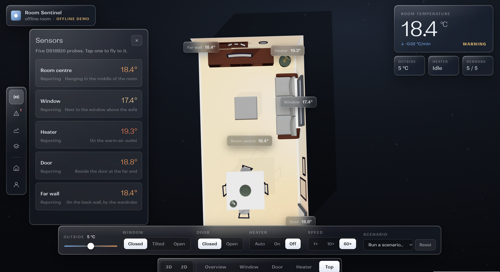
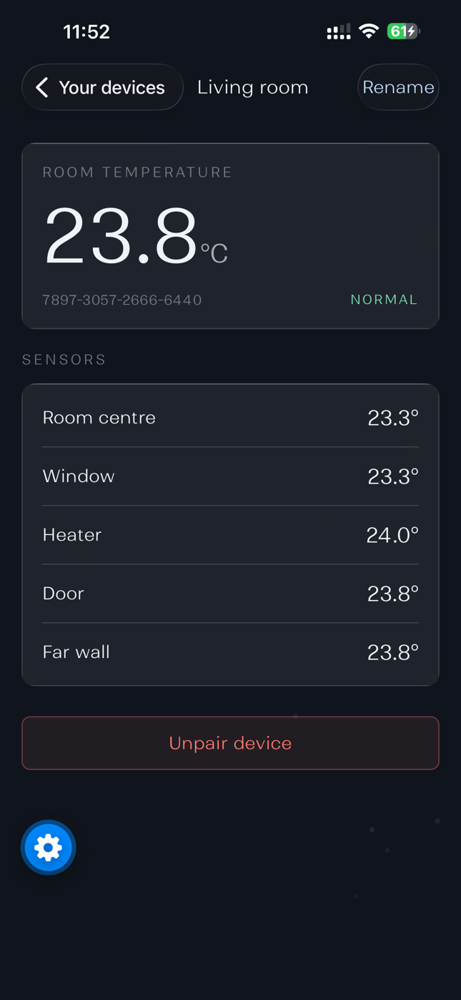
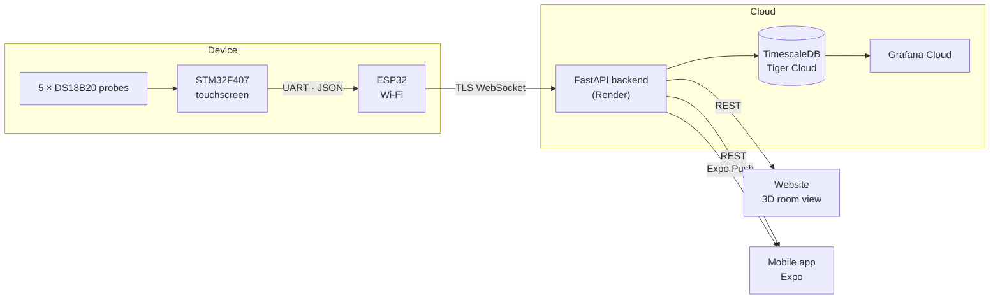
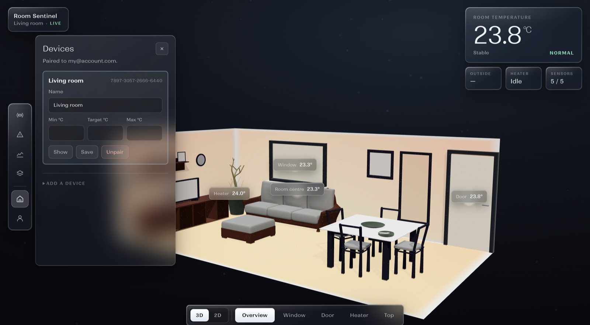
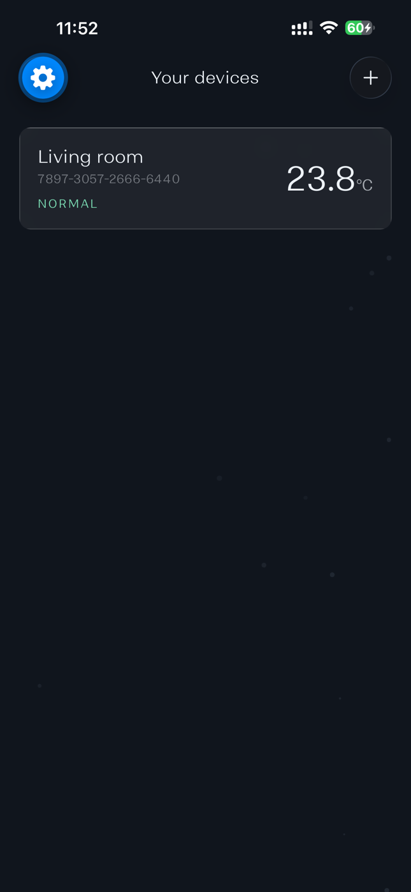
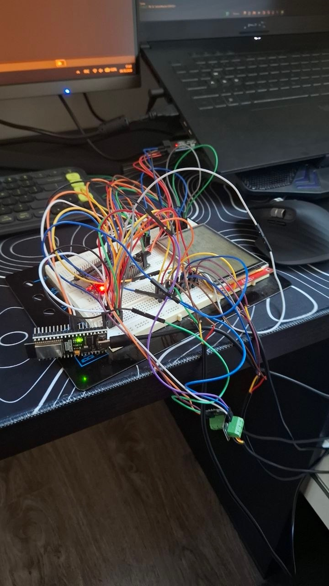
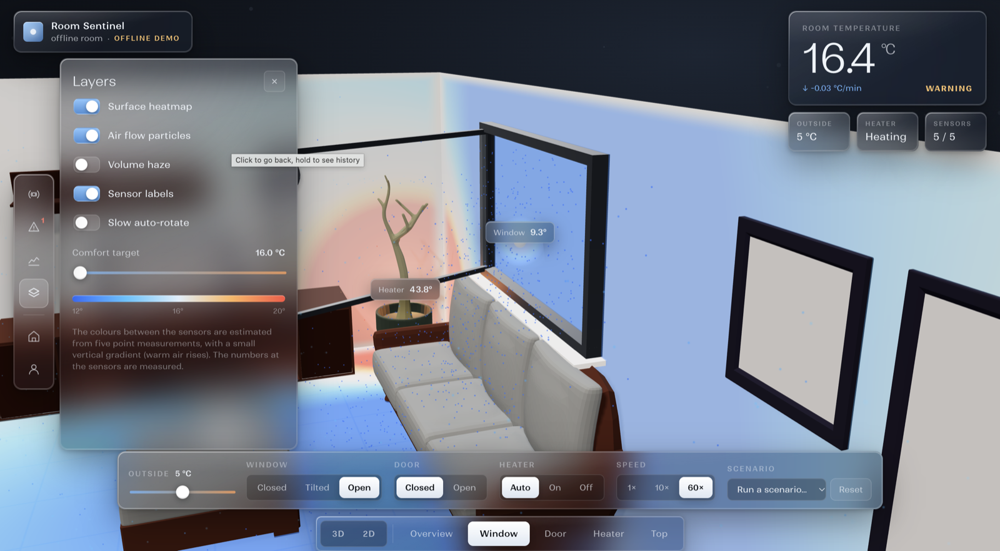
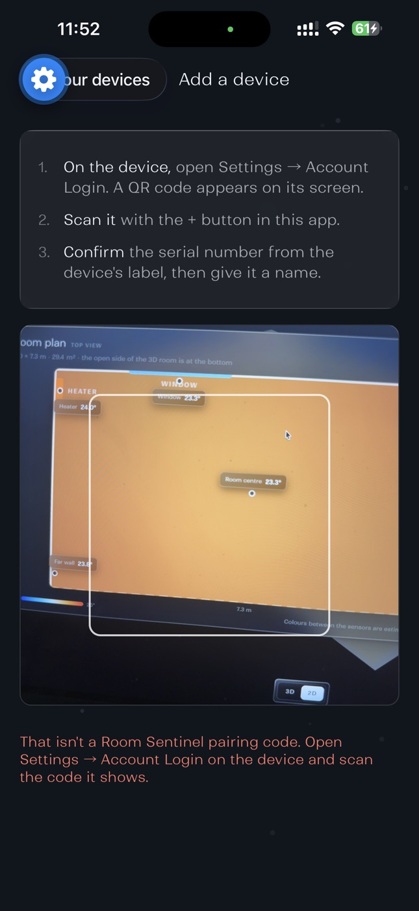
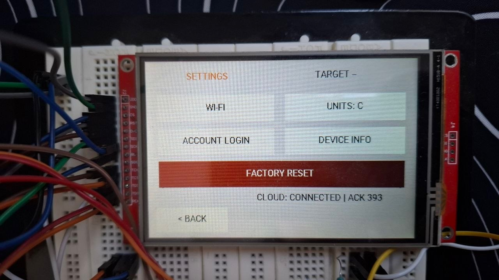
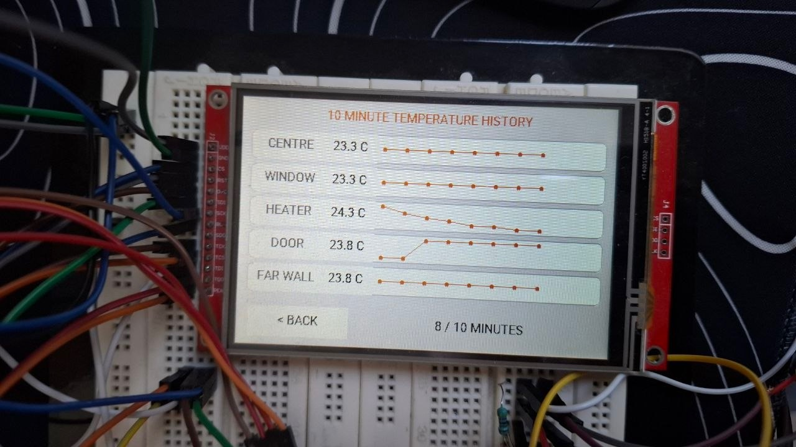

# Room Sentinel

**Knows when your room is losing heat — and tells you why, where, and what to do.**

Five temperature probes, a touchscreen controller and a cloud backend that learns how your room
normally behaves. When it cools faster than it should (an open window, a heater that stopped,
a door left open), Room Sentinel says so on the website, on the device and as a push notification
on your phone, with a forecast and a concrete fix.


**[Live demo →](https://stormhacks-ten.vercel.app/room-view/)**

<p align="center">
  
  
</p>

## Features

- **Live room view.** A 3D model of the room (and a 2D plan) coloured by the five readings.
- **Learns the room.** Fits how leaky the room is and how strongly the heater warms it,
  from the data itself, per device.
- **Detects what a thermostat can't.** Cooling faster than expected, and from which side
  (window, door), heating that stopped, a sensor that failed, a device that went silent.
  A hand on a probe is recognised and ignored.
- **Forecasts.** "Below 18 °C in about 25 min."
- **Advice, not just alarms.** Every alert comes with what to do, and a "resolved" message
  when the room is back to normal. No alert every second.
- **Push notifications** on iOS and Android through the mobile app.
- **QR pairing.** The device shows a QR code; scan it, confirm, done.
- **Demo mode.** A physics-based simulated room — change the outside temperature, open the
  window, switch the heater off — running through exactly the same detector as a real device.

## How it works



Every reading goes through the same pipeline, for real and demo devices alike:

| Stage | What happens |
|---|---|
| **Collect** | Validate each probe (`-127` disconnected, `85` power-on value, impossible values) and timestamp on arrival |
| **Analyze** | Analyzers turn readings into findings and metrics: sensor health, device silence, and the thermal model |
| **Advise** | Each finding becomes a recommendation ("Close the window — 18 °C in about 25 min") |
| **Track** | One issue per problem: opened, escalated, reminder, resolved |
| **Notify** | Push to the owner's phones, and the live view on the website |

### The thermal model

The analyzer learns, per device, what "normal" looks like:

```
expected rate of change = g · (outside − room) + h · (heater − room) + c
```

`g` is how leaky the room is, `h` how strongly the heater warms it. Both are re-fitted from
the last hours of data. When the measured rate keeps falling below the expected one, something
the model can't explain is happening — usually an open window or door — and the probe whose gap
to the room centre grows fastest shows where it comes from.

## Screenshots

| Website | Mobile app | Device |
|---|---|---|
|  |  |  |
|  |  |  |
| | |  |

## Tech stack

| Part | Built with |
|---|---|
| Sensors and controller | 5 × DS18B20, STM32F407 (FreeRTOS, ILI9488 touchscreen), STM32CubeIDE |
| Connectivity | ESP32-WROOM (ESP-IDF): Wi-Fi provisioning, HTTPS pairing, TLS WebSocket |
| Backend | Python 3.12, FastAPI, SQLAlchemy + Alembic, psycopg, Docker on Render |
| Data | TimescaleDB on Tiger Cloud (hypertables), Grafana Cloud dashboards and alerts |
| Website | three.js, GSAP, plain JavaScript modules (no build step), Vercel |
| Mobile | Expo (React Native, TypeScript), Expo Router, Expo Push |

## Repository structure

```
backend/            FastAPI app, Sentinel pipeline, simulator, Alembic migrations, tests
  src/sentinel/       ingest · analysis · advice · issues · notify · sim · demo
  src/device/         pairing and device management
  src/push/           push token registration
  src/auth/           accounts and login
frontend/room-view/ the website (3D room view)        → frontend/room-view/README.md
frontend/react-app/ first version of the website (legacy, reference only)
mobile/             Expo app for iOS and Android
STM32/              controller firmware                → STM32/README.md
ESP32/              Wi-Fi bridge firmware              → ESP32/README.md
grafana/            dashboard and alert rule, pushed with grafana/push.py
docs/               protocols, pairing, push notifications, images
```

## Getting started

**Backend**
```bash
cd backend
python3 -m venv .venv && source .venv/bin/activate
pip install -r requirements.txt
cp ../.env.example ../.env                # fill in the database settings
set -a; source ../.env; set +a            # load them into this shell
alembic upgrade head
uvicorn src.main:app --reload             # http://localhost:8000/docs
python -m pytest -q tests
```
Without a database: `python -m src.sentinel.run --no-db` replays `samples/sample.log` through the pipeline.

**Website**
```bash
cd frontend && python3 -m http.server 8080   # http://localhost:8080/room-view/
```
Or run the backend and the website together: `docker compose up`.

**Mobile app**
```bash
cd mobile && npm install && npx expo start
```
Push notifications need a development build (`npx expo run:ios` / `npx expo run:android`).

**Firmware:** see [STM32/README.md](STM32/README.md) and [ESP32/README.md](ESP32/README.md).

## Device protocol

The ESP32 sends one WebSocket frame per measurement:

```json
{"serial": "1234-5678-9012-3456", "seq": 42, "uptime_ms": 38500,
 "temps": {"Centre": 22.4, "Window": 21.8, "Heater": 29.1, "Door": null, "Far wall": 22.3}}
```

The server timestamps it on arrival (no clock on the device) and answers with an acknowledgement.
`null` means the probe failed to read. More: [server protocol](docs/server-protocol.md) ·
[device pairing](docs/device-pairing.md) · [push notifications](docs/push-notifications.md) ·
[STM32 ↔ ESP32](docs/stm32-esp32-protocol.md).

## Limitations

- DS18B20 probes are accurate to ±0.5 °C. Small differences between probes can be calibration, not physics.
- The colours between probes are an interpolation from five points, not a measured map.
- The model needs about an hour of data before it judges cooling. Until then only fixed limits apply.
- Unmeasured heat (sun, people, laptops) adds noise. The detector tolerates it but doesn't model it.
- Detection was developed and tested mostly on the simulator; real-room validation is the next step.

## Team

| | Worked on |
|---|---|
| **Alezhuq Kutryk** | Backend: accounts, database, device pairing, Grafana |
| **Sergei Naumov** | Hardware and firmware: STM32 controller, ESP32 Wi-Fi bridge |
| **Anton Polamarchuk** | First website: dashboard, sign-in and accounts |
| **Nikolay Deinego** | Detection pipeline and simulator, mobile app, 3D website |

## License

Copyright © 2026 Alezhuq Kutryk, Sergei Naumov, Anton Polamarchuk and Nikolay Deinego.
All rights reserved. The code is public to view, not to reuse — see [LICENSE](LICENSE).

## Acknowledgements

- Room model "room" by [yYett](https://sketchfab.com/3d-models/room-65f4aba797c04c56a8dc25205a1c7713), CC BY 4.0.
- The mobile app started from the Expo app template (MIT, © 650 Industries, Inc.).
